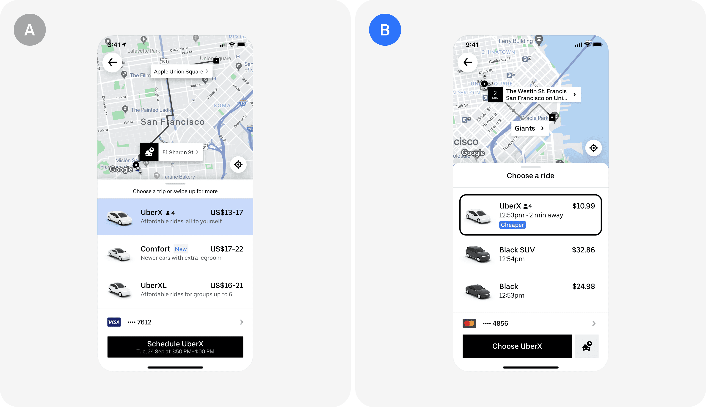

# Финальный проект: A/B-эксперимент на настоящей инфраструктуре

Это финальный проект Симулятора бигтеха. Ты пройдёшь полный цикл продуктового
A/B-теста так, как он устроен в Яндексе, Тинькофф, Ozon или Uber: от продуктовой
идеи и карточки гипотезы — через запуск на реальной сплитовалке и мониторинг
на дашборде — до статистического анализа, решения и поэтапной раскатки.

Читай этот документ сверху вниз и делай по шагам. Всё, что нужно, — здесь.

---

## Продуктовый кейс

### Добро пожаловать в команду

Ты — аналитик продуктовой команды, которая отвечает за **главный экран заказа
поездки**. Это один из самых критичных экранов приложения: от того, насколько
понятно и честно показана цена, зависит доверие пользователя, конверсия в заказ
и итоговая выручка. Команда влияет на миллионы поездок ежедневно.

Твоя зона ответственности как аналитика:

- поведение пользователя на экране выбора поездки;
- причины, по которым пользователь **не завершает заказ**;
- воронка: открытие приложения → просмотр экрана → выбор тарифа → заказ → поездка;
- оценка влияния изменений интерфейса и логики цены;
- контроль, что изменения **не ухудшают** опыт и экономику поездок.

### Идея, с которой приходит продакт

Сейчас цена на экране показывается **диапазоном**: «$14–20». Из исследований
известно, что люди ориентируются на **верхнюю границу**, тревожатся, что заплатят
максимум, — и часть пользователей уходит, не оформив заказ.

Продакт предлагает: **показывать одну ориентировочную цену**, например «$17.29»,
чтобы снизить неопределённость и повысить доверие. Дизайн подготовил два макета:
вариант A (диапазон, как сейчас) и вариант B (точечная цена):



Твоя задача — спроектировать, запустить и проанализировать эксперимент, который
ответит: **приведёт ли это изменение к росту оформленных поездок и не навредит
ли оно чему-то ещё**.

Вопросы продакту по кейсу — ментору в телеграм: **@asiriatskiy**.

---

## Что ты развернёшь

Вся инфраструктура эксперимента поднимается у тебя локально в докере:

| Сервис | Роль в проекте | Адрес | Логин / пароль |
|:-------|:---------------|:------|:---------------|
| **Сплитовалка** (FastAPI) | админка экспериментов, сплитование, реестр метрик | http://localhost:8000 | — |
| — её API (Swagger) | то же самое из кода | http://localhost:8000/docs | — |
| **PostgreSQL** | пользователи, конфиг экспериментов, абшница | `localhost:5434`, БД `platform` | `platform` / `platform` |
| **ClickHouse** | поток событий `ab.events`, витрины метрик | `localhost:8123` (HTTP) | `default` / `platform` |
| **Airflow** | автоматический расчёт метрик эксперимента | http://localhost:8081 | `admin` / `admin` |
| **Superset** | дашборд эксперимента для продакта | http://localhost:8089 | `admin` / `admin` |
| Генератор трафика | симулятор пользователей (фоновый сервис) | — | — |

Пользователи в системе — **симулированные, но статистически честные**: тяжёлый
хвост частоты поездок, сезонность по часам и дням недели, реалистичные цены.
Время ускорено: **1 виртуальный день = 10 реальных минут**, поэтому двухнедельный
эксперимент занимает у тебя пару часов, а не полмесяца.

---

## Шаг 0. Окружение с нуля

### 0.1. Установи Docker Desktop

- **Mac**: https://www.docker.com/products/docker-desktop/ — скачай, установи, запусти. Дождись зелёного кита в меню-баре.
- **Windows**: тот же сайт; при установке согласись на WSL2. После установки перезагрузись.

Докеру нужно **8 ГБ памяти** (4 ГБ хватит для лёгкого профиля). Проверить и поднять:
Mac — Docker Desktop → Settings → Resources → Memory; Windows — файл
`%UserProfile%\.wslconfig`, секция `[wsl2]`, строка `memory=8GB`, затем `wsl --shutdown`.

### 0.2. Склонируй проект

Обязательно в домашнюю папку (не в системные каталоги — докер их не видит):

```bash
cd ~ && git clone https://github.com/mentoring-analyst/ab-platform.git && cd ab-platform
```

### 0.3. Проверь окружение и подними стек

```bash
make check
```

Скрипт проверит докер, память, диск и порты и скажет, если что-то не так. Затем:

```bash
make up
```

Это лёгкий профиль: базы + сплитовалка + генератор (~3 ГБ). При первом старте
генератор создаст ~150 тыс. пользователей и нальёт 45 виртуальных дней истории
(~7.5 млн событий) — меньше минуты. Смотри прогресс:

```bash
docker compose logs -f generator
```

Дождись строки `история готова` — дальше генератор перейдёт в живой режим
и начнёт тикать виртуальными часами.

### 0.4. Проверь, что всё живо

- Открой админку: http://localhost:8000 — в шапке должно показываться виртуальное время.
- Открой Swagger: http://localhost:8000/docs — дёрни `GET /sim/now`.

### 0.5. Подключи SQL-клиент

Работать с базами будем из SQL-клиента. Подойдёт [DBeaver](https://dbeaver.io/download/)
(бесплатный) или DataGrip (платный, но у студентов часто есть лицензия JetBrains).
Нужно завести **два подключения** — к PostgreSQL и к ClickHouse.

Параметры для справки:

| | PostgreSQL | ClickHouse |
|---|---|---|
| Host | `localhost` | `localhost` |
| Port | **`5434`** (не стандартный 5432!) | `8123` |
| Database | `platform` | `ab` (можно оставить пустым) |
| User | `platform` | `default` |
| Password | `platform` | `platform` |

<details>
<summary><b>DBeaver: пошагово</b></summary>

**PostgreSQL:**

1. Скачай и установи DBeaver Community: https://dbeaver.io/download/
2. Меню **База данных → Новое соединение** (или иконка «вилка с плюсом» слева сверху).
3. В списке выбери **PostgreSQL** → «Далее».
4. Заполни поля: Host `localhost`, Port `5434`, Database `platform`,
   Username `platform`, Password `platform`. Поставь галочку «Save password».
5. Нажми **«Тест соединения»**. При первом разе DBeaver предложит скачать
   драйвер PostgreSQL — жми «Скачать». Должна появиться надпись «Connected».
6. «Готово». Слева в дереве раскрой соединение: `platform` → Схемы —
   там должны быть схемы **core** (пользователи) и **ab** (эксперименты).
   Если их не видно — нажми F5 (обновить).

**ClickHouse:**

1. Снова **База данных → Новое соединение**, в поиске набери `clickhouse`.
2. Выбери драйвер **ClickHouse** (именно ClickHouse, не «ClickHouse (Legacy)») → «Далее».
3. Заполни: Host `localhost`, Port `8123`, Database — оставь пустым или `ab`,
   Username `default`, Password `platform`, галочка «Save password».
4. «Тест соединения» → «Скачать» драйвер → «Connected» → «Готово».
5. В дереве: база **ab** → таблицы `events`, `assignments`, `experiment_metrics_daily`.

**Как выполнить запрос:** правой кнопкой по соединению → «SQL-редактор» →
«Новый SQL-редактор» (или Cmd/Ctrl+]). Пишешь запрос, выполняешь Cmd/Ctrl+Enter.
Проверь, что редактор привязан к нужному соединению — оно выбирается в выпадашке
на панели сверху.

</details>

<details>
<summary><b>DataGrip: пошагово</b></summary>

**PostgreSQL:**

1. В окне Database Explorer нажми **+ → Data Source → PostgreSQL**.
2. Заполни: Host `localhost`, Port `5434`, Database `platform`,
   User `platform`, Password `platform`.
3. Внизу окна будет предупреждение «Download missing driver files» — нажми **Download**.
4. Нажми **Test Connection** — должна появиться зелёная галочка. Затем OK.
5. Важная особенность DataGrip: по умолчанию он показывает не все схемы.
   Рядом с соединением нажми на выпадашку схем (или вкладка **Schemas**
   в свойствах источника) и отметь галочками **core** и **ab**.

**ClickHouse:**

1. **+ → Data Source → ClickHouse**.
2. Host `localhost`, Port `8123`, User `default`, Password `platform`,
   Database `ab` — обязательно **маленькими буквами**, ClickHouse чувствителен
   к регистру.
3. Рядом с полем Driver будет написано «Not downloaded» — нажми ссылку
   **Download** (без этого будет ошибка «Driver class … not found»).
4. **Test Connection** → зелёная галочка → OK.
5. В списке схем отметь базу **ab**.

**Как выполнить запрос:** открой консоль источника (правой кнопкой по
соединению → New → Query Console), пиши запрос и выполняй Cmd/Ctrl+Enter.

</details>

Проверь оба подключения запросами:

```sql
-- Postgres: сколько пользователей в каждом регионе
SELECT region_code, count(*) FROM core.users GROUP BY region_code;
```

```sql
-- ClickHouse: сколько событий и за какой период
SELECT count(), min(event_date), max(event_date) FROM ab.events;
```

---

## Шаг 1. Погрузись в данные

Прежде чем что-то тестировать, аналитик разбирается, как устроен продукт в данных.
События воронки в `ab.events` (ClickHouse):
`app_open → screen_view → tariff_select → order_confirm → trip_complete / order_cancelled`.
У событий экрана есть поля цены: `price_low`/`price_high` (диапазон) и
`price_shown` (точечная цена — появится у тестовых групп после запуска эксперимента).

Ответь SQL-запросами (эти цифры понадобятся тебе дальше — в расчёте выборки
и карточке):

1. Сколько уникальных пользователей активны в день? В неделю?
2. Как выглядит сезонность по часам и дням недели? Когда пики?
3. Какая конверсия `screen_view → order_confirm` на пользователя в день? По регионам?
4. Как распределено число поездок на пользователя за 45 дней? Почему среднее
   сильно больше медианы и что это значит для дисперсии метрик?
5. Как показанная цена связана с конверсией в заказ?

---

## Шаг 2. Продуктовая проработка

### 2.1. Задай вопросы продакту

Прежде чем проектировать тест, аналитик снимает неопределённость. Подумай,
что нужно спросить: какой бизнес-эффект ожидается? меняется расчёт цены или
только подача? какие города участвуют? что считаем негативным эффектом?
Сформулируй свои вопросы и задай их ментору (@asiriatskiy) — он играет роль
продакта и отвечает в его логике.

### 2.2. Сформулируй гипотезу

Формат: **«Если мы сделаем X, то для аудитории Y метрика Z изменится на W,
потому что …»**. Гипотеза без механизма («потому что») — не гипотеза, а хотелка.

### 2.3. Собери набор метрик

- **Целевая** — по ней принимается решение (одна, максимум две).
- **Прокси** — объясняют механизм (шаги воронки).
- **Защитные (guardrails)** — чтобы не навредить: отмены, жалобы, экономика.

Готовые метрики уже лежат в реестре платформы (админка → «Метрики»). Изучи их
SQL — тебе предстоит написать свою по этому образцу.

### 2.4. Заполни карточку эксперимента

Карточка — документ, по которому любой аналитик компании поймёт твой тест
через год. Как её сделать:

1. Возьми шаблон [templates/experiment_card.md](templates/experiment_card.md):
   скопируй файл к себе или перенеси структуру в Notion — как удобнее.
2. Заполни все разделы, кроме расчёта выборки (он — следующий шаг).
3. Отправь ментору в личку в телеграм (**@asiriatskiy**): файлом `.md`/PDF
   или ссылкой на Notion-страницу.

Ментор посмотрит и вернётся с комментариями — после правок карточка считается
утверждённой. Без утверждённой карточки эксперимент не запускается, как
и в настоящей компании. Дальше по ходу проекта ты будешь дополнять эту же
карточку: результатами A/A, расчётом выборки, итогами анализа.

---

## Шаг 3. Размер выборки, длительность и проверка критерия

Продакт говорит: «Хочу быть уверен, что поймаем даже эффект в **0.5 п.п.**».

Открой ноутбук [templates/sample_size_calculation.ipynb](templates/sample_size_calculation.ipynb)
и пройди его: базовая конверсия из истории → аналитический калькулятор →
**имитационный A/A на исторических данных**: корректен ли выбранный критерий
для твоей метрики — гистограмма p-value должна быть равномерной, а доля ложных
прокрасов держаться на уровне alpha → проверка мощности симуляциями (Monte
Carlo) → SQL-оценка, сколько аудитории под твоими фильтрами реально есть
в данных и за сколько дней наберётся расчётная выборка.
Заодно в ноутбуке — справка, как из Python подключаться к любой базе данных
(конструкция `connect → cursor.execute → fetchall`).

Итог шага — **ответ продакту**: реализуемо ли его пожелание на нашем трафике,
и если нет — какие есть варианты и что они стоят. Числа занеси в карточку
(раздел «Размер выборки и длительность») и отправь ментору обновлённую версию.

---

## Шаг 4. A/A-тест: проверь инструмент перед боем

Критерий ты уже проверил имитационным A/A в ноутбуке — на исторических данных.
Теперь проверяем **инструмент**: в бигтехе перед важным экспериментом сплитовалку
проверяют живым A/A-тестом — две одинаковые группы, никакого различия между ними.
Если «эффект» нашёлся — сломан сплит или логирование, и запускать боевой тест нельзя.

В админке (http://localhost:8000 → «+ Эксперимент») создай:

- код `aa_sanity_check`, варианты A 50% / B 50%;
- аудитория — та же, что будет в боевом тесте;
- целевая метрика — та же.

Запусти, подожди 3–5 виртуальных дней (полчаса реального времени), посмотри
на странице эксперимента набор аудитории, затем провери:

1. **SRM** (Sample Ratio Mismatch): фактические доли групп против плановых 50/50 —
   хи-квадрат тестом.
2. Целевая метрика A vs B — различий быть не должно (p-value > 0.05).

Останови A/A и зафиксируй результат в карточке (раздел «Риски и мониторинг»).

---

## Шаг 5. Запусти боевой эксперимент

В админке создай эксперимент по утверждённой карточке:

- код: `pricing_point_estimate`;
- варианты и доли трафика — из карточки. Доли задаются **от всего трафика
  аудитории**: A 20% + B 20% значит, что эксперимент идёт на 40% трафика,
  а 60% в него не попадают. Подумай (и напиши в карточке), почему компании
  редко запускают рискованные тесты сразу на 100%;
- фильтры аудитории — регион и активность из карточки;
- метрики с ролями: целевая, прокси, защитные.

Нажми **«Запустить»**. С этого момента генератор трафика при каждом заходе
пользователя спрашивает у сплитовалки его вариант — так же, как это делает
бэкенд настоящего приложения. Пользователь попадает в эксперимент при первом
заходе (exposure), поэтому аудитория набирается постепенно.

Проверь себя через полчаса: на странице эксперимента группы наполняются,
фактические доли соответствуют плану.

Как это работает внутри: вариант = детерминированный хеш
`murmur3(соль_эксперимента + user_id)`. Один и тот же пользователь всегда
получает один и тот же вариант — без хранения состояния. Назначения фиксируются
в абшнице `ab.assignments` (Postgres).

---

## Шаг 6. Автоматизация и дашборд для продакта

Пока эксперимент набирает данные, построй мониторинг — продакт будет смотреть
на него каждый день (и ты тоже).

До сих пор у тебя работал лёгкий профиль стека: базы, сплитовалка, генератор.
Теперь нужно поднять оставшиеся два сервиса — Airflow (автоматический расчёт
метрик) и Superset (дашборды). Для этого открой **Терминал**, перейди в папку
проекта и выполни команду:

```bash
cd ~/ab-platform && make up-full
```

Это та же команда семейства `make`, что и `make up` из шага 0, только профиль
«full»: докер скачает образы Airflow и Superset (при первом запуске — пара
гигабайт, несколько минут) и запустит их **вдобавок** к уже работающим
контейнерам — эксперимент при этом не прерывается. Понадобится ~8 ГБ памяти,
выделенной докеру (если `make check` ругался — подними лимит, как описано
в шаге 0.1).

Проверь, что всё поднялось: `make ps` — в списке должны появиться
`airflow-webserver`, `airflow-scheduler` и `ab-superset` в статусе Up. После
этого в браузере откроются два новых сервиса:

- **Airflow** — http://localhost:8081, логин `admin`, пароль `admin`;
- **Superset** — http://localhost:8089, логин `admin`, пароль `admin`.

Первый запуск инициализируется минуту-две (миграции баз) — если страница
пустая или не открывается, подожди и обнови (Cmd+R / F5).

Расчёт метрик заработает **сам**: вместе с полным профилем поднимается Airflow,
и его DAG `ab_experiment_metrics` каждые 5 минут автоматически считает дневные
метрики всех активных экспериментов. Тебе ничего включать не нужно — просто
следи за страницей эксперимента в админке: там растёт счётчик попавших в тест,
а в таблице «Метрики по дням» появляются значения по мере закрытия виртуальных
дней. Заглянуть, как это устроено под капотом, можно в Airflow
(http://localhost:8081) и в коде DAG-а
([airflow/dags/ab_experiment_metrics.py](airflow/dags/ab_experiment_metrics.py)).

**В Superset собери дашборд** по гайду
[docs/superset_dashboard.md](docs/superset_dashboard.md): текущий виртуальный
день, кривая набора аудитории по группам, SRM-таблица, динамика целевой
и защитных метрик.

### Своя метрика через SQL

Одной из метрик карточки в реестре нет — заведи её сам: админка → «Метрики» →
«Новая метрика». Пишешь SQL по контракту (шаблон уже в форме), платформа
прогоняет его в ClickHouse до сохранения: синтаксическая ошибка вернётся тебе
человеческим сообщением. Если метрика сломается уже в процессе расчёта —
на странице эксперимента загорится бейдж «⚠ не считается» с текстом ошибки,
а остальные метрики продолжат считаться.

---

## Шаг 7. Дисциплина эксперимента

Эксперимент должен отработать срок из карточки (2 виртуальные недели ≈ 2.5 часа
реального времени). Подглядывать в дашборд можно и нужно — принимать решение
по третьему дню нельзя. Если по дороге загорелся SRM или резко упала защитная
метрика — это причина остановить тест досрочно; рост целевой — нет. Почему?
Ответ должен быть в дереве решений твоей карточки.

---

## Шаг 8. Анализ и решение

Срок вышел — останови эксперимент кнопкой и проведи анализ (ноутбук финального
проекта из курса — теперь данные тянутся SQL-ем из ClickHouse, а не из CSV):

1. **Sanity-checks до метрик**: SRM, равномерность набора по дням, полнота логов.
2. **Целевая метрика**: подходящий критерий (доля → z-тест), p-value, доверительный
   интервал, сравнение эффекта с MDE из карточки.
3. **Прокси и защитные метрики**: где механизм сработал, где деградация.
   Для ratio-метрик (отмены на заказ) юнит анализа мельче юнита рандомизации —
   вспомни, чем это грозит и какие методы это учитывают (дельта-метод, бутстрап).
4. **Выводы и рекомендация**: раскатываем / не раскатываем / дорабатываем — 
   с аргументами, ограничениями и рисками. Обнови карточку результатами —
   это финальная версия, которую ты сдашь ментору.

Подсказка из жизни: если один из вариантов выигрывает по целевой метрике,
это ещё не значит, что его надо раскатывать. Смотри на защитные.

---

## Шаг 9. Поэтапная раскатка

В бигтехе победивший вариант не включают сразу всем. Его раскатывают поэтапно,
оставляя **holdout** — небольшую контрольную группу, по которой ещё несколько
недель следят, что долгосрочные метрики не деградируют.

Смоделируй это: создай эксперимент `pricing_rollout` — победивший вариант
на 90% трафика, контроль (holdout) 10%, та же целевая и защитные метрики.
Запусти, дай поработать несколько виртуальных дней и проверь на дашборде,
что эффект воспроизводится на широкой аудитории.

Вопрос на подумать: чем раскатка с holdout отличается от «повторного
эксперимента» методологически, и почему держать holdout вечно — тоже плохо?

---

## Формат сдачи

1. **Карточка эксперимента** (файл `.md`/PDF или Notion-страница) — все разделы,
   включая расчёт выборки, результат A/A, итоги анализа и решение.
   Отправляется ментору в телеграм.
2. **Ноутбук анализа** — sanity-checks, тесты, интервалы, выводы.
3. **Скриншот дашборда** из Superset.
4. **Короткое резюме для продакта** (5–7 предложений без статистического жаргона):
   что тестировали, что получили, что делаем дальше.

Критерии приёмки — у ментора; спойлер: он сверит найденные тобой эффекты
с истинными, заложенными в симуляцию.

---

## Если что-то сломалось

[docs/troubleshooting.md](docs/troubleshooting.md) — коды 137, память докера,
пустые чарты в Superset, лимиты ClickHouse, занятые порты, полный сброс стенда.

Полезные команды:

```bash
make ps      # статус контейнеров
make logs    # логи всех сервисов
make down    # остановить стек (данные сохраняются)
make reset   # полный сброс: удаляет ВСЕ данные
```

---

## Как устроен репозиторий

```
docker-compose.yml      # весь стек; лимиты памяти на каждом сервисе
splitter/               # FastAPI: админка, сплитование, реестр метрик
generator/              # симулятор трафика: популяция, воронка, виртуальные часы
airflow/dags/           # DAG репликации абшницы и расчёта витрины метрик
superset/               # образ Superset с драйверами ClickHouse/Postgres
postgres/init/          # схемы core (пользователи) и ab (эксперименты)
clickhouse/init/        # ab.events, ab.assignments, витрина метрик
templates/              # карточка эксперимента, ноутбук расчёта выборки
docs/                   # гайд по дашборду, troubleshooting, гайд ментора
```

Эффекты вариантов зашиты в закодированный сценарий генератора — не декодируй
его, если не хочешь заспойлерить себе результат собственного эксперимента.

Смежный модуль курса — [data-platform](https://github.com/simulator-mentoring/data-platform):
отдельный проект про повседневную рабочую среду аналитика (SQL, витрины, DAG-и,
дашборды без экспериментов).
